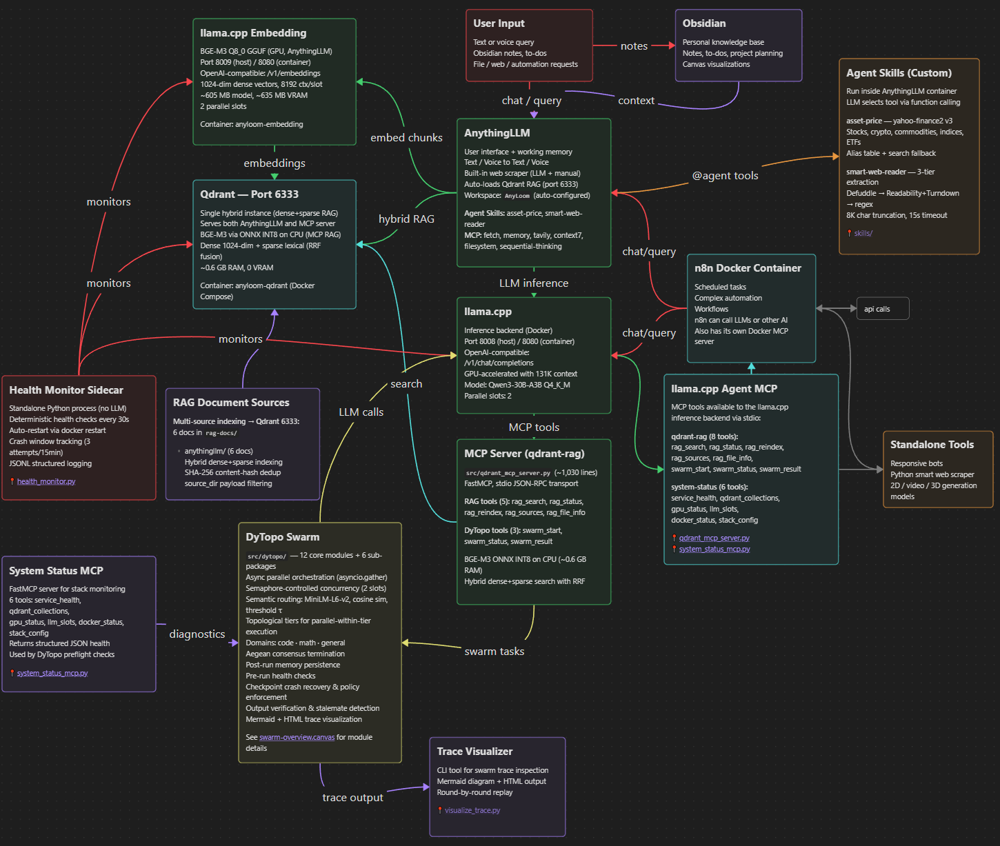
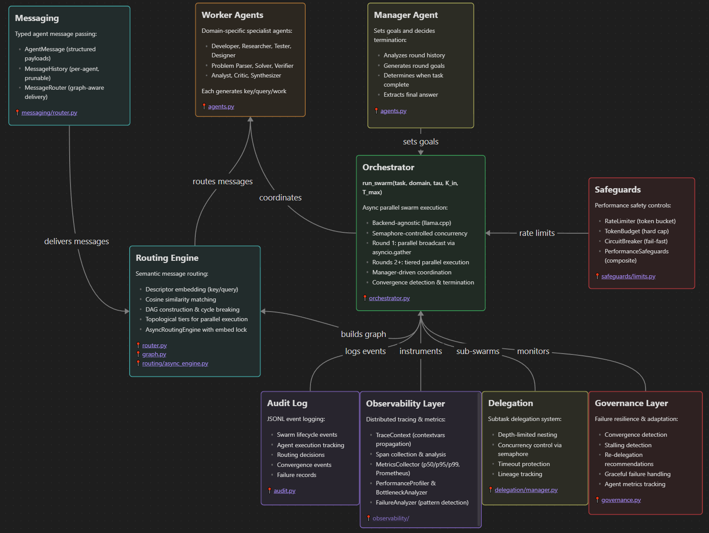

# AnyLoom: AnythingLLM Local AI Agentic Stack

**A fully local, multi-agent AI system that gives you ChatGPT-level intelligence with complete privacy and control over your data.**

> **Now with Docker!** One command starts the entire stack. Zero manual setup.

---

## 💡 What Can You Do With This?

**Run a production-grade AI assistant stack entirely on your hardware:**

- 🔒 **100% private** — No data leaves your machine. No API keys. No subscriptions.
- 🧠 **Advanced reasoning** — Qwen3-30B MoE (30.5B params, 3.3B active) with hybrid thinking mode
- 📚 **Hybrid RAG search** — Finds YOUR information better than pure vector search (dense + sparse retrieval)
- 🤖 **Multi-agent swarm** — DyTopo coordination routes complex tasks to specialized agents that collaborate, with optional RAG context pre-fetch for domain grounding
- 🛡️ **Reliability hardening** — Checkpoint crash recovery, deny-first policy enforcement, deterministic output verification, stalemate detection
- 🛠️ **8 MCP servers** — Memory knowledge graph, web search, file operations, sequential thinking, RAG search, multi-agent swarm, system diagnostics
- 🐋 **Docker-first architecture** — One command to start/stop everything. Auto-restart. Zero networking hassles.
- 💬 **AnythingLLM UI** — Clean interface for chat, document Q&A, and workspace management

**Ideal for:**
- Engineers who need AI assistance with proprietary codebases
- Researchers handling sensitive documents (legal, medical, financial)
- Privacy-conscious users who want ChatGPT-level capability without cloud dependency
- Developers building custom AI workflows with persistent memory and multi-agent collaboration

---

## Why AnyLoom vs Cloud AI or Single-LLM Setups?

|                       | AnyLoom                                     | Cloud AI (ChatGPT, Claude)      | Single Local LLM          |
| --------------------- | -------------------------------------------- | ------------------------------- | ------------------------- |
| **Privacy**           | ✅ 100% local, zero telemetry                 | ❌ Your data trains their models | ✅ Local                   |
| **Cost**              | ✅ One-time hardware investment               | ❌ $20-200/month subscription    | ✅ Free after setup        |
| **Retrieval Quality** | ✅ Hybrid dense+sparse RAG                    | ⚠️ Dense-only embeddings        | ⚠️ Basic or no RAG        |
| **Multi-Agent Swarm** | ✅ DyTopo routing, 3-5 agents                 | ❌ Single model per request      | ❌ Single model            |
| **Persistent Memory** | ✅ MCP knowledge graph across sessions        | ⚠️ Limited to conversation      | ❌ No cross-session memory |
| **Tool Ecosystem**    | ✅ 8 MCP servers (RAG, swarm, web, memory, files, diagnostics) | ⚠️ Limited, cloud-gated         | ❌ Manual integration      |
| **Context Window**    | ✅ 131K tokens (configurable)                  | ⚠️ 128K (expensive tiers)       | ⚠️ Varies by model        |
| **Offline Use**       | ✅ Fully functional                           | ❌ Requires internet             | ✅ Fully functional        |

**The bottom line:** If you need ChatGPT-level capability for sensitive work, AnyLoom gives you near the same intelligence without the privacy trade-offs or subscription costs.

---

## 🌐 How It Works

AnyLoom runs as a **Docker Compose stack** with these services:

- **Qdrant** (port 6333) — Vector database for hybrid dense+sparse RAG
- **llama.cpp LLM** (port 8008) — GPU-accelerated inference with 131K context (Qwen3-30B-A3B)
- **llama.cpp Embedding** (port 8009) — BGE-M3 embedding server for AnythingLLM (1024-dim dense vectors)
- **AnythingLLM** (port 3001) — Web UI for chat and document management
- **DyTopo swarm** (Python, runs natively) — Multi-agent orchestration with stigmergic trace-aware routing
- **Health Monitor** (Python sidecar) — Deterministic health checks with auto-restart and crash window protection
- **8 MCP servers** — RAG search, DyTopo swarm, memory graph, web search, file ops, system diagnostics, and more

**Everything starts with one command.** Docker handles networking, GPU access, auto-restart, and data persistence.





| Component                                          | Tokens                     |
| -------------------------------------------------- | -------------------------- |
| Total Token Budget                                 | 131K                       |
| System prompt                                      | ~2K                        |
| MCP tool definitions (6 AnythingLLM + 2 agent)      | ~3K                        |
| RAG snippets (16 × ~500 tokens)                    | ~8K                        |
| Chat history (30 messages)                         | ~12K                       |
|                             **Overhead Subtotal:** | **~25K**                   |
| **Remaining for chat**                             | **~106K**                  |

The entire RAG-prompt set fits comfortably inside the token limit. Context length is configurable (default 131K). Q4_K_M model weights are ~18.6 GiB, leaving ample room for KV cache on 32GB GPUs. See `docs/llm-engine.md` for VRAM budget details.

> ✅ Laptop Profile — RTX 2070 Max-Q (8GB VRAM), Qwen2.5-Coder-7B, 8K context, CPU embedding

---

## 🛠️ Prerequisites

All you need:

| Component | Desktop (main branch) | Laptop (this branch) |
|-----------|----------------------|---------------------|
| **GPU** | RTX 4090/5090 (32GB VRAM) | RTX 2070/2080 (8GB VRAM) |
| **LLM** | Qwen3-30B-A3B Q4_K_M | Qwen2.5-Coder-7B Q4_K_M |
| **Context** | 131K tokens | 8K tokens |
| **Embedding** | BGE-M3 on GPU | BGE-M3 on CPU |
| **RAM** | 64GB+ | 32GB |
| **CPU** | 12+ core | 6+ core |
| **Docker** | v24.0+ with WSL2/GPU | v24.0+ with WSL2/GPU |
| **NVIDIA Driver** | 535+ | 535+ |

> **Docker handles everything:** Qdrant, llama.cpp (LLM + Embedding), and AnythingLLM run as containers. No manual WSL setup or service management!

---

## 🚀 Quickstart

### 1. Clone and Download Model

```bash
git clone <repo-url>
cd AnyLoom

# Download models
mkdir -p models
pip install huggingface_hub

# LLM model — Qwen2.5-Coder-7B-Instruct Q4_K_M (~4.5 GB, GPU)
huggingface-cli download Qwen/Qwen2.5-Coder-7B-Instruct-GGUF \
  qwen2.5-coder-7b-instruct-q4_k_m.gguf \
  --local-dir models

# Embedding model — BGE-M3 Q8_0 (~605 MB, GPU)
huggingface-cli download ggml-org/bge-m3-Q8_0-GGUF \
  bge-m3-q8_0.gguf \
  --local-dir models
```

> **Already have the LLM GGUF?** Symlink instead of re-downloading:
> `ln -s /path/to/qwen2.5-coder-7b-instruct-q4_k_m.gguf models/`

### 2. Start the Docker Stack

```bash
# One command starts everything (creates volumes, checks model, waits for health)
bash scripts/docker_start.sh

# Or manually (must create volumes first)
docker volume create anyloom_qdrant_storage
docker volume create anyloom_anythingllm_storage
docker volume create anyloom_anythingllm_hotdir
docker compose up -d
```

**Startup takes ~2 minutes** while llama.cpp loads the model into GPU VRAM. First query may take an additional 1-2 minutes as the prompt cache warms up.

### 3. Configure AnythingLLM

1. Open **http://localhost:3001** and complete the initial setup wizard (password, preferences). The API is locked until this is done.
2. Then run the automated configuration:

```bash
python scripts/configure_anythingllm.py
```

This configures AnythingLLM system defaults (LLM provider, max tokens, BGE-M3 embedding, vector DB, chunk size/overlap, default system prompt), creates an AnyLoom workspace, uploads and embeds the RAG reference documents from `rag-docs/anythingllm/` into the workspace's vector store, pushes tuned workspace settings, and runs a smoke test. Re-running the script is safe — it skips documents that are already uploaded and embedded.

### 4. Access Services

- **AnythingLLM UI:** http://localhost:3001
- **llama.cpp LLM API:** http://localhost:8008/v1/models
- **llama.cpp Embedding API:** http://localhost:8009/v1/embeddings
- **Qdrant Dashboard:** http://localhost:6333/dashboard

### 5. Run Benchmarks (Optional)

```bash
# Install Python dependencies first
pip install -r requirements-dytopo.txt

# Test the full stack (all 6 phases)
ANYTHINGLLM_API_KEY=your-key python scripts/benchmarks/bench_run_all.py

# Or test just llama.cpp directly (no AnythingLLM needed)
ANYTHINGLLM_API_KEY=your-key python scripts/benchmarks/bench_phase5_llm.py
```

Phase 5 validates llama.cpp directly — fabrication guards, tool boundary awareness, and depth calibration. Current score: **15/20 (75%)** with perfect marks on fabrication guards, adversarial resistance, cross-workspace parity, depth stability, and LLM direct validation. See [benchmark results](scripts/benchmarks/docs/benchmark-results-showcase.md) for full scores.

---

## 🔧 Management Commands

```bash
# View logs
bash scripts/docker_logs.sh llm           # llama.cpp only
bash scripts/docker_logs.sh anythingllm  # AnythingLLM only
docker compose logs -f                    # All services

# Stop services
bash scripts/docker_stop.sh
# Or: docker compose down

# Restart a specific service
docker compose restart llm

# Check status
docker compose ps

# Start the health monitor sidecar (optional, runs alongside Docker)
python scripts/health_monitor.py

# Remove everything including data (⚠️ DESTRUCTIVE)
docker compose down -v
```

---

## 📚 Documentation

> **Start here:** [`INSTALL.md`](INSTALL.md) — Docker-based installation guide (repo root)

Reference documentation in `docs/`:

| Document | Contents |
|----------|----------|
| `architecture.md` | System topology, VRAM budget, port assignments |
| `llm-engine.md` | llama.cpp Docker container config, GPU settings, troubleshooting |
| `qwen3-model.md` | Qwen3-30B-A3B MoE architecture, quantization, sampling |
| `bge-m3-embedding.md` | BGE-M3 embedding architecture (ONNX INT8 CPU for MCP RAG + llama.cpp GGUF for AnythingLLM, 1024-dim dense vectors) |
| `qdrant-topology.md` | Qdrant Docker container, collection schema, sync |
| `qdrant-servers.md` | MCP server inventory, tool definitions, token budget |
| `dytopo-swarm.md` | DyTopo multi-agent routing, package architecture, domains, lifecycle |
| `anythingllm-settings.md` | AnythingLLM Docker container, provider config, workspace setup |
| [`benchmark-results-showcase.md`](scripts/benchmarks/docs/benchmark-results-showcase.md) | Benchmark results across all rounds |

### DyTopo Package (`src/dytopo/`)

| Module | Purpose |
|--------|---------|
| `models.py` | Pydantic v2 data models (AgentState, SwarmTask with RAG context field, SwarmMetrics, etc.) |
| `config.py` | YAML configuration loader with defaults (`dytopo_config.yaml`) |
| `agents.py` | System prompts, JSON schemas, domain rosters |
| `router.py` | MiniLM-L6-v2 embedding, cosine similarity, threshold, degree cap, intent embedding enrichment, descriptor separation validation |
| `stigmergic_router.py` | Trace-aware topology: Qdrant-persisted swarm traces, time-decayed boost matrix |
| `graph.py` | NetworkX DAG construction, cycle breaking, topological sort |
| `orchestrator.py` | Main swarm loop with singleton inference client, Aegean termination, memory persistence; integrates checkpoint, policy, verifier, stalemate modules via guarded imports |
| `governance.py` | Convergence detection, stalling detection, re-delegation, Aegean consensus voting, stalemate detection with generalist fallback |
| `checkpoint.py` | CheckpointManager for crash recovery — atomic writes, Pydantic v2 serialization, resume from last good checkpoint |
| `policy.py` | PolicyEnforcer (PCAS-Lite) — deny-first tool-call policy enforcement with path traversal prevention |
| `verifier.py` | OutputVerifier for deterministic output verification — syntax check, schema validation, no LLM |
| `audit.py` | JSONL audit logging to `~/dytopo-logs/{task_id}/` |
| `health/checker.py` | Pre-run health probes for LLM, Qdrant, AnythingLLM, GPU |
| `memory/writer.py` | Post-run swarm result persistence to structured storage |

### Supporting Services

| Component | Purpose |
|-----------|---------|
| `src/mcp_servers/system_status_mcp.py` | FastMCP server: 6 diagnostic tools (service_health, qdrant_collections, gpu_status, llm_slots, docker_status, stack_config) |
| `scripts/health_monitor.py` | Standalone sidecar: periodic health checks, auto-restart via `docker restart`, crash window protection (3 attempts/15min), JSONL logging |
| `scripts/visualize_trace.py` | CLI trace visualizer: generates Mermaid flowcharts and self-contained HTML timelines from audit.jsonl logs, with loop/stall detection |

---

## 🔄 Data & Persistence

- **Docker Volumes** (persist across restarts):
  - `anyloom_qdrant_storage` — Vector database
  - `anyloom_anythingllm_storage` — AnythingLLM workspaces
  - `anyloom_anythingllm_hotdir` — AnythingLLM document collector

- **Host Bind Mount:**
  - `./models/` — GGUF model files (~19.2 GB total). LLM model (~18.6 GB) + embedding model (~605 MB). Place both files here before starting.

- **Filesystem Access:** All configuration files and Python scripts are local
- **Model Updates:** Replace the GGUF file in `./models/` and restart: `docker compose restart llm`
- **RAG Re-indexing:** Re-run `python scripts/configure_anythingllm.py` (idempotent) or re-embed documents via AnythingLLM UI

```bash
# View volumes
docker volume ls | grep anyloom

# Backup a volume
docker run --rm -v anyloom_qdrant_storage:/data -v $(pwd):/backup ubuntu tar czf /backup/qdrant_backup.tar.gz /data

# Remove all data (⚠️ DESTRUCTIVE)
docker compose down -v
```

---

> ✅ **You're now running a next-gen, fully local AI agentic stack.**
> Start creating, querying, and orchestrating with AnyLoom today.
