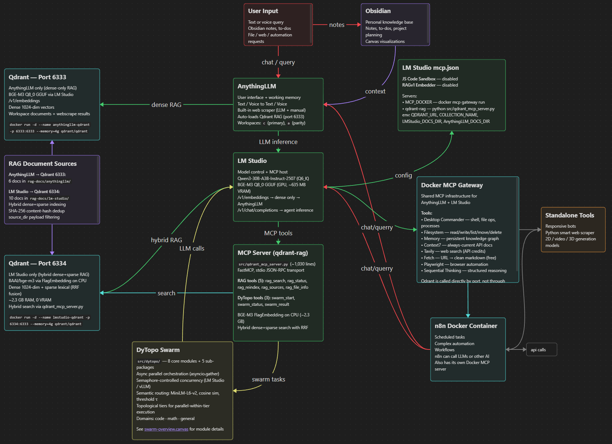

# AnyLoom: AnythingLLM Local AI Agentic Stack

**A fully local, multi-agent AI system that gives you ChatGPT-level intelligence with complete privacy and control over your data.**

---

## 💡 What Can You Do With This?

**Run a production-grade AI assistant stack entirely on your hardware:**

- 🔒 **100% private** — No data leaves your machine. No API keys. No subscriptions.
- 🧠 **Advanced reasoning** — Qwen3-30B with 80K context handles complex tasks, multi-step planning, and long documents
- 📚 **Hybrid RAG search** — Finds YOUR information better than pure vector search (dense + sparse retrieval)
- 🤖 **Multi-agent swarm** — DyTopo coordination routes complex tasks to specialized agents that collaborate
- 🛠️ **17 MCP tools** — Memory, web search, browser automation, file operations, code execution, persistent knowledge graphs
- 💬 **Two AI interfaces**:
  - **AnythingLLM** — Clean UI for chat, document Q&A, voice I/O
  - **LM Studio** + Custom server.py Advanced agent mode with tool orchestration

**Ideal for:**
- Engineers who need AI assistance with proprietary codebases
- Researchers handling sensitive documents (legal, medical, financial)
- Privacy-conscious users who want ChatGPT-level capability without cloud dependency
- Developers building custom AI workflows with persistent memory and multi-agent collaboration

---

## 🧠 Why AnyLoom vs Cloud AI or Single-LLM Setups?

|                       | 🧠AnyLoom🧠                                  | Cloud AI (ChatGPT, Claude)      | Single Local LLM          |
| --------------------- | -------------------------------------------- | ------------------------------- | ------------------------- |
| **Privacy**           | ✅ 100% local, zero telemetry                 | ❌ Your data trains their models | ✅ Local                   |
| **Cost**              | ✅ One-time hardware investment               | ❌ $20-200/month subscription    | ✅ Free after setup        |
| **Retrieval Quality** | ✅ Hybrid dense+sparse RAG                    | ⚠️ Dense-only embeddings        | ⚠️ Basic or no RAG        |
| **Multi-Agent Swarm** | ✅ DyTopo routing, 3-5 agents                 | ❌ Single model per request      | ❌ Single model            |
| **Persistent Memory** | ✅ MCP knowledge graph across sessions        | ⚠️ Limited to conversation      | ❌ No cross-session memory |
| **Tool Ecosystem**    | ✅ 10 MCP servers (web, code, files, browser) | ⚠️ Limited, cloud-gated         | ❌ Manual integration      |
| **Context Window**    | ✅ 80K tokens (~200K chars)                   | ⚠️ 128K (expensive tiers)       | ⚠️ Varies by model        |
| **Offline Use**       | ✅ Fully functional                           | ❌ Requires internet             | ✅ Fully functional        |

**The bottom line:** If you need ChatGPT-level capability for sensitive work, AnyLoom gives you near the same intelligence without the privacy trade-offs or subscription costs.

---

## 🌐 How It Works

AnyLoom transforms **AnythingLLM** into a dynamic, self-optimizing multi-agent swarm using:

- **Hybrid RAG fusion** (dense + sparse retrieval) — better recall than pure vector search
- **Dual Qdrant pipelines**:
    - port `6333` → AnythingLLM (dense-only RAG)
    - port `6334` → LM Studio (hybrid dense+sparse RAG via MCP)
- **10 MCP servers** (9 Docker + 1 qdrant-rag) — memory, tools, and agent coordination (17 total tools)
- **DyTopo swarm intelligence** — routes complex tasks to specialized agents
- **Fully local execution** — no cloud dependencies, no data leakage



| Component                                          | Tokens                     |
| -------------------------------------------------- | -------------------------- |
| Total Token Budget                                 | 80k                        |
| System prompt                                      | ~2K                        |
| MCP tool definitions (9 Docker + 1 qdrant-rag)     | ~3K                        |
| RAG snippets (16 × ~500 tokens)                    | ~8K/8192 embedding         |
| Chat history (30 messages)                         | ~12K                       |
|                             **Overhead Subtotal:** | **~25K**                   |
| **Remaining for chat**                             | **~55K**  ~200k characters |
The entire RAG-prompt set fits comfortably inside the token limit (two qdrants means I could have 16k worth of RAG and never miss a prompt)

> ✅ Runs on a single GPU (optimized for RTX 5090, but functional on smaller RAM pools)

---

## 🛠️ Prerequisites

Ensure the following are installed and running:

|COMPONENT|VERSION / REQUIREMENT|
|---|---|
|**LM Studio**|Latest version (local server on `:1234`)|
|**AnythingLLM**|v1.0+ (local UI)|
|**Docker Desktop**|Running with access to containers|
|**Python**|3.12+|
|**GPU**|RTX 5090 (recommended), or any capable GPU|

> 🔐 **Note**: Memory (local knowledge graph for state and agent persistence) is accessible by both agents on this machine. AnythingLLM workspaces maintain separate RAG contexts.

---

## 🚀 Quickstart

### 1. Start Qdrant Containers

```bash
# AnythingLLM RAG (dense-only)
docker run -d --name anythingllm-qdrant \
  -p 6333:6333 \
  -v qdrant_anythingllm:/qdrant/storage \
  --restart always \
  --memory=4g \
  --cpus=4 \
  qdrant/qdrant:latest

# LM Studio RAG (hybrid dense+sparse via MCP)
docker run -d --name lmstudio-qdrant \
  -p 6334:6333 \
  -v qdrant_lmstudio:/qdrant/storage \
  --restart always \
  --memory=4g \
  --cpus=4 \
  qdrant/qdrant:latest
```

> 📌 Access dashboards at:
>
> - [http://localhost:6333](http://localhost:6333) (AnythingLLM)
> - [http://localhost:6334](http://localhost:6334) (LM Studio)

---

### 2. Load Models in LM Studio

Download the following GGUF models:

- **LLM**: `unsloth/Qwen3-30B-A3B-Instruct-2507-GGUF` (Q6_K)
- **Embedding (GPU pipeline)**: `ggml-org/bge-m3-Q8_0`

> 📌 **Dual Embedding Pipeline:**
> - The **GGUF model** runs on GPU (~635 MB VRAM) and serves AnythingLLM's RAG pipeline with dense vectors only.
> - The **CPU pipeline** uses `BAAI/bge-m3` (via FlagEmbedding) for LM Studio's MCP tools, providing hybrid dense+sparse search. This model **auto-downloads** (~1.1 GB) on first use — no manual download needed.
> - See [bge-m3-embedding.md](docs/bge-m3-embedding.md) for details on both pipelines.

---

### 3. Install Dependencies

```bash
pip install \
  FlagEmbedding \
  torch --index-url https://download.pytorch.org/whl/cpu \
  qdrant-client>=1.12.0 \
  mcp[cli]>=1.0.0 \
  sentence-transformers>=3.0 \
  networkx>=3.0 \
  openai>=1.40 \
  tenacity>=9.0 \
  json-repair>=0.39 \
  pydantic>=2.0 \
  pyyaml>=6.0
```

---

### 4. Configure MCP

Copy the MCP config file to the correct location:

```bash
# Replace with your actual path
cp lmstudio-mcp.json "C:\Users\User\.lmstudio\config\mcp.json"
```

> 🔧 **Important**: Update the `mcp.json` path to match your installation directory.

---

### 5. Configure AnythingLLM

In the AnythingLLM UI:

- **LLM Endpoint**: `http://127.0.0.1:1234/v1`
- **Vector DB**: `http://127.0.0.1:6333`
- **Embedding Model**: `bge-m3` (via `http://127.0.0.1:1234/v1/embeddings`)

> 📄 See [anythingllm-settings.md](docs/anythingllm-settings.md) for full configuration.

---

### 6. Configure LM Studio

In LM Studio settings:

- **System Prompt**: Copy into the "My Models" tab (not Developer) to persist across sessions
- **JS Code Sandbox**: Disable built-in MCP server
- **RAGv1 Embedder**: Disable built-in MCP server

> 🔄 Restart LM Studio after changes to verify tool registration.

---

### 7. Verify Setup

Run these checks:

|CHECK|COMMAND / URL|EXPECTED|
|---|---|---|
|LM Studio|`http://127.0.0.1:1234/v1`|Returns JSON (model loaded)|
|Qdrant (6333)|[http://localhost:6333](http://localhost:6333)|Dashboard accessible|
|Qdrant (6334)|[http://localhost:6334](http://localhost:6334)|Dashboard accessible|
|MCP Tools|Restart LM Studio|**8 qdrant-rag tools** should appear (5 RAG + 3 DyTopo)|
|AnythingLLM|Create workspace, embed test doc, query|Success|

> ⚠️ If containers aren't running, you'll get connection errors.

---

## 📚 Documentation

Full reference documentation is available in the `docs/` directory:

| Document | Contents |
|----------|----------|
| `architecture.md` | System topology, VRAM budget, port assignments |
| `qwen3-model.md` | Qwen3-30B-A3B MoE config, quantization, sampling |
| `bge-m3-embedding.md` | BGE-M3 dual pipeline (GGUF + FlagEmbedding) |
| `qdrant-topology.md` | Dual Qdrant instances, collection schema, sync |
| `qdrant-servers.md` | MCP server inventory, tool definitions, token budget |
| `dytopo-swarm.md` | DyTopo multi-agent routing, package architecture, domains, lifecycle |
| `anythingllm-settings.md` | AnythingLLM provider config, chunking, workspace |
| `lm-studio-settings.md` | LM Studio model settings, sampling, API consumers |
| [`benchmark-results-showcase.md`](scripts/benchmarks/docs/benchmark-results-showcase.md) | Benchmark results across all rounds |

### DyTopo Package (`src/dytopo/`)

| Module | Purpose |
|--------|---------|
| `models.py` | Pydantic v2 data models (AgentState, SwarmTask, SwarmMetrics, etc.) |
| `config.py` | YAML configuration loader with defaults (`dytopo_config.yaml`) |
| `agents.py` | System prompts, JSON schemas, domain rosters |
| `router.py` | MiniLM-L6-v2 embedding, cosine similarity, threshold, degree cap |
| `graph.py` | NetworkX DAG construction, cycle breaking, topological sort |
| `orchestrator.py` | Main swarm loop with singleton AsyncOpenAI client |
| `governance.py` | Convergence detection, stalling detection, re-delegation |
| `audit.py` | JSONL audit logging to `~/dytopo-logs/{task_id}/` |

---

## 🔄 Access & Maintenance

- **Filesystem Access**: All configuration files, logs, and models are stored locally.
- **Container Management**: Use `docker ps`, `docker logs`, and `docker stop` for diagnostics.
- **Model Updates**: Re-download GGUF models in LM Studio when needed.
- **RAG Re-indexing**: Re-embed documents via AnythingLLM or MCP CLI.

---

> ✅ **You're now running a next-gen, fully local AI agentic stack.**
> 🚀 Start creating, querying, and orchestrating with AnyLoom today.
